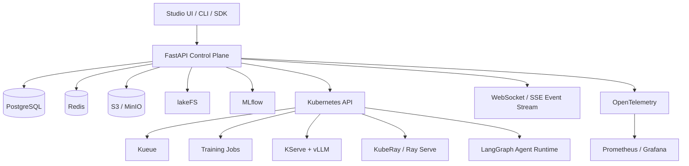

# Agent Studio 平台设计文档

面向对象：多租户 / GPU 集群 / 生产平台

更新时间：2026-03-19

---

## 1. 目标

这个 Agent Studio 不是单纯的“对话应用后台”，而是一个统一 AI Platform Control Plane，覆盖：

- agent 编写、版本化、测试、部署
- LLM 微调、评测、注册、部署
- 数据集接入、版本管理、训练数据治理
- 多租户资源隔离、GPU 作业调度、审计与配额

设计原则：

- FastAPI 只做控制面，不直接承担训练或长时推理执行
- 训练、推理、agent runtime 全部下沉到 Kubernetes 执行面
- 所有核心对象必须版本化，可审计，可回滚，可复现
- 默认支持多租户、配额、权限、可观测性、安全基线

---

## 2. 总体分层



分层职责：

- 控制面：FastAPI、鉴权、元数据、状态聚合、任务下发、事件流
- 执行面：训练作业、推理服务、agent runtime、评测作业
- 数据面：对象存储、数据版本、模型注册、审计日志

---

## 3. 推荐技术栈

| 层 | 技术栈 | 说明 |
|---|---|---|
| API 控制面 | FastAPI + Pydantic + SQLAlchemy | 统一 REST / WebSocket API |
| 元数据数据库 | PostgreSQL | 业务主存储 |
| 缓存与事件分发 | Redis | 状态缓存、事件 fanout、短队列 |
| 对象存储 | S3 / MinIO | 数据集、checkpoint、模型工件、日志附件 |
| 数据版本 | lakeFS | 数据 commit / branch / merge / rollback |
| 模型注册 | MLflow | 实验跟踪、模型 lineage、Model Registry |
| GPU 作业调度 | Kubernetes + Kueue | 统一批作业调度与配额控制 |
| 标准推理部署 | KServe + vLLM | OpenAI-compatible serving |
| 大规模推理 | KubeRay + Ray Serve LLM | 多节点或复杂路由场景 |
| 微调训练 | Axolotl / LLaMA-Factory / TRL + PEFT | LoRA、QLoRA、SFT、DPO |
| Agent Runtime | LangGraph | durable execution、streaming、HITL |
| 测试与评测 | pytest + LangSmith + Promptfoo | 功能、评测、安全红队 |
| 可观测性 | OpenTelemetry + Prometheus + Grafana | tracing、metrics、dashboards |

技术选型原则：

- 默认部署后端为 `KServe + vLLM`
- 默认训练后端为 `Axolotl`
- `LLaMA-Factory` 作为低门槛模板层
- `TRL + PEFT` 作为可编排底层能力
- 只有在多节点或复杂 serving 场景时才引入 `Ray Serve`

---

## 4. 多租户架构

隔离建议：

- 一个 `tenant` 对应一个 Kubernetes namespace
- `project` 作为租户内逻辑隔离边界
- 训练任务、部署任务、agent runtime 使用独立 ServiceAccount
- S3 / MinIO 使用按 tenant 划分的 bucket prefix
- lakeFS 使用按 tenant 或 project 划分的 repo / branch 策略
- MLflow 用 tags、aliases、permissions 做对象隔离

必须具备：

- Namespace
- ResourceQuota
- LimitRange
- RBAC least privilege
- Secret 管理与 at-rest encryption
- NetworkPolicy 默认 deny
- 审计日志不可关闭

---

## 5. 核心资源模型

平台内的一等公民资源：

- `Tenant`
- `Project`
- `Environment`
- `Dataset`
- `DatasetVersion`
- `Artifact`
- `TrainingJob`
- `Model`
- `ModelVersion`
- `Deployment`
- `AgentSpec`
- `AgentRevision`
- `AgentRun`
- `EvalSuite`
- `EvalRun`
- `SecretRef`
- `Operation`
- `AuditEvent`

核心关系：

- `Tenant` 1:N `Project`
- `Project` 1:N `Dataset`
- `Dataset` 1:N `DatasetVersion`
- `DatasetVersion` 1:N `TrainingJob`
- `TrainingJob` 1:1 `ModelVersion`（成功产出时）
- `Model` 1:N `ModelVersion`
- `ModelVersion` 1:N `Deployment`
- `AgentSpec` 1:N `AgentRevision`
- `AgentRevision` 1:N `AgentRun`
- `EvalSuite` 1:N `EvalRun`
- `Operation` 统一追踪训练、部署、评测、发布等异步任务

---

## 6. API 设计原则

统一前缀：

```text
/api/v1
```

API 规范：

- 创建异步任务返回 `202 Accepted`
- 所有异步任务都返回 `operation_id`
- 所有列表接口使用 cursor pagination
- 错误响应统一使用 RFC 7807
- 写操作支持 `Idempotency-Key`
- WebSocket / SSE 仅用于事件订阅，不承载强业务命令

---

## 7. API 资源分组

### 7.1 Tenant / Project

- `POST /tenants`
- `GET /tenants/{tenant_id}`
- `POST /projects`
- `GET /projects/{project_id}`
- `POST /projects/{project_id}/quotas`
- `GET /projects/{project_id}/usage`

### 7.2 Dataset

- `POST /datasets`
- `POST /datasets/{dataset_id}/imports`
- `POST /datasets/{dataset_id}/versions`
- `GET /datasets/{dataset_id}/versions`
- `POST /dataset-versions/{version_id}/validate`
- `POST /dataset-versions/{version_id}/splits`

### 7.3 Training

- `POST /training-jobs`
- `GET /training-jobs/{job_id}`
- `POST /training-jobs/{job_id}/cancel`
- `GET /training-jobs/{job_id}/logs`
- `GET /training-jobs/{job_id}/metrics`

### 7.4 Model Registry

- `POST /models`
- `GET /models/{model_id}`
- `GET /models/{model_id}/versions`
- `POST /model-versions/{version_id}/promote`
- `POST /model-versions/{version_id}/archive`
- `GET /model-versions/{version_id}/lineage`

### 7.5 Deployment

- `POST /deployments`
- `GET /deployments/{deployment_id}`
- `POST /deployments/{deployment_id}/scale`
- `POST /deployments/{deployment_id}/traffic-shift`
- `POST /deployments/{deployment_id}/rollback`
- `GET /deployments/{deployment_id}/health`

### 7.6 Agent

- `POST /agents`
- `POST /agents/{agent_id}/revisions`
- `GET /agents/{agent_id}/revisions`
- `POST /agent-revisions/{revision_id}/publish`
- `POST /agent-runs`
- `GET /agent-runs/{run_id}`
- `POST /agent-runs/{run_id}/interrupt`

### 7.7 Evaluation

- `POST /eval-suites`
- `POST /eval-runs`
- `POST /redteam-runs`
- `GET /eval-runs/{run_id}/report`

### 7.8 Operation / Event / Audit

- `GET /operations/{operation_id}`
- `GET /events/ws`
- `GET /audit-events`

---

## 8. 关键服务与关键函数

Router 只收参和回包，Service 负责业务决策，Integration / Gateway 只负责和外部系统交互。

### `tenant_service.py`

- `create_tenant()`
- `create_project()`
- `assign_project_quota()`
- `enforce_tenant_policy()`

### `dataset_service.py`

- `create_dataset()`
- `ingest_dataset_files()`
- `create_dataset_version()`
- `validate_dataset_schema()`
- `materialize_training_split()`

### `training_service.py`

- `submit_training_job()`
- `build_training_spec()`
- `submit_kueue_job()`
- `cancel_training_job()`
- `sync_training_status()`

### `model_registry_service.py`

- `register_model_version()`
- `attach_lineage()`
- `promote_model_version()`
- `resolve_serving_artifact()`

### `deployment_service.py`

- `deploy_kserve_service()`
- `deploy_ray_service()`
- `shift_traffic()`
- `rollback_deployment()`
- `collect_endpoint_health()`

### `agent_service.py`

- `create_agent_revision()`
- `build_agent_bundle()`
- `publish_agent_revision()`
- `start_agent_run()`
- `interrupt_agent_run()`

### `eval_service.py`

- `run_offline_eval()`
- `run_online_eval()`
- `run_redteam_suite()`
- `compare_model_versions()`

### `event_service.py`

- `publish_event()`
- `stream_run_events()`
- `tail_pod_logs()`

### `cluster_gateway.py`

- `apply_manifest()`
- `read_pod_status()`
- `read_pod_logs()`
- `delete_workload()`

### `audit_service.py`

- `record_audit_event()`
- `list_audit_events()`

---

## 9. 状态机

### TrainingJob

`DRAFT -> QUEUED -> ADMITTED -> RUNNING -> SUCCEEDED | FAILED | CANCELED`

### ModelVersion

`REGISTERED -> VALIDATED -> STAGED -> PRODUCTION -> DEPRECATED`

### Deployment

`PENDING -> PROVISIONING -> READY -> SCALING | DEGRADED | FAILED -> DELETING`

### AgentRevision

`DRAFT -> TESTED -> APPROVED -> PUBLISHED -> DEPRECATED`

### AgentRun

`QUEUED -> RUNNING -> WAITING_TOOL | WAITING_HUMAN -> SUCCEEDED | FAILED | ABORTED`

### EvalRun

`QUEUED -> RUNNING -> COMPLETED | FAILED`

---

## 10. 关键业务流程

### 10.1 数据到模型

1. 上传原始数据到对象存储
2. 在 lakeFS 创建数据版本
3. 执行 schema / quality 校验
4. 提交训练任务到 Kueue
5. 训练容器读取指定 DatasetVersion
6. 产出模型工件并注册到 MLflow
7. 生成 ModelVersion 与 lineage

### 10.2 模型到部署

1. 选择 `ModelVersion`
2. 生成 serving spec
3. 创建 KServe 或 Ray Serve 部署
4. 回写 deployment endpoint、状态、指标
5. 通过 traffic shift 做灰度或回滚

### 10.3 Agent 开发到发布

1. 创建 `AgentSpec`
2. 提交提示词、工具权限、模型绑定、工作流定义
3. 生成 `AgentRevision`
4. 运行离线评测与 red team
5. 审批通过后发布
6. 进入线上 `AgentRun`

---

## 11. 安全与审计

关键要求：

- 训练、部署、agent tool 调用全部进入审计
- Prompt、Tool、Dataset、Model、Config 都必须版本化
- 工具权限与模型提示词分离，不能依赖 prompt 做访问控制
- 敏感凭据只存 `SecretRef`，实际值进入 Secret Manager 或 K8s Secret
- 默认启用请求级身份链路，便于审计谁发起了训练、发布、回滚

建议审计字段：

- `actor_id`
- `tenant_id`
- `project_id`
- `resource_type`
- `resource_id`
- `action`
- `before_state`
- `after_state`
- `request_id`
- `ip`
- `user_agent`
- `created_at`

---

## 12. 可观测性

最少要有三类观测数据：

- Metrics：QPS、延迟、GPU 利用率、作业排队时长、token throughput
- Traces：API 请求、任务提交流程、agent 执行链路、外部服务调用
- Logs：训练日志、推理服务日志、agent 工具调用日志、审计日志

建议关键指标：

- `training_queue_wait_seconds`
- `training_run_seconds`
- `deployment_ready_seconds`
- `agent_run_duration_seconds`
- `agent_tool_error_total`
- `inference_tokens_per_second`
- `gpu_utilization_ratio`

---

## 13. 后端目录结构建议

```text
backend/
  app/
    api/v1/
    core/
    schemas/
    models/
    repositories/
    services/
    controllers/
    events/
    integrations/
      kubernetes/
      kserve/
      ray/
      mlflow/
      lakefs/
      object_store/
    security/
    workers/
```

模块原则：

- `api/v1`：路由与协议层
- `schemas`：请求/响应 DTO
- `models`：数据库实体
- `repositories`：数据库读写
- `services`：核心业务逻辑
- `integrations`：外部系统适配器
- `events`：事件模型与广播
- `security`：鉴权、租户隔离、权限校验

---

## 14. 第一阶段必须做的最小闭环

生产平台第一阶段建议只打通一条主链路：

1. 多租户与配额
2. 数据集上传与版本化
3. 训练任务提交与状态追踪
4. 模型注册与版本管理
5. KServe + vLLM 部署
6. AgentRevision 发布与基础运行
7. WebSocket 日志与事件流
8. 审计日志

先不要在第一阶段做过多 backend 选择器。否则控制面会先失控。

---

## 15. 明确不做

当前阶段不建议：

- 在 FastAPI 进程内直接执行训练逻辑
- 让 Redis 承担系统主存储
- 同时支持过多 serving backend
- 不做版本控制就允许上线模型或 agent
- 依赖 prompt 自己约束工具权限

---

## 16. 参考资料

- FastAPI Bigger Applications
- FastAPI WebSockets
- Kubernetes GPU Scheduling
- Kueue
- vLLM OpenAI-Compatible Server
- KServe
- Ray Serve LLM
- Axolotl
- LLaMA-Factory
- Hugging Face TRL
- Hugging Face PEFT
- MLflow Model Registry
- MinIO
- lakeFS
- LangGraph
- LangSmith
- Promptfoo
